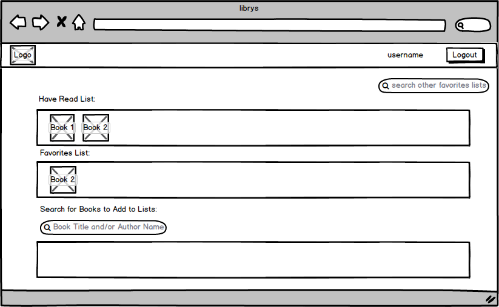

# librys
A handy web bookshelf where you can track books you've read!

librys uses the Google Books API to allow users to easily search for books they've read. Books can be stored on their "bookshelf" for easy reference and can also be rated and/or favorited.

## WDI-SM-23 Project 4

librys allows you to track books you've read and rate them for easy reference.

Use the app [Here](https://pacific-hollows-56597.herokuapp.com/)

Or you to install the app, fork the GitHub [repository](https://github.com/susanrotondo/librys") You will then need to:

* Clone the forked repo to your local workspace
* In your local app directory, use npm install to install app dependencies specified in package.json
* Connect your local app to a local (MongoDB) or remote (mLab) database of your own

#### Project's [Trello Board](https://trello.com/b/dWFTB4wy)

## Technologies:
* JavaScript
* Node.js
* MongoDB
* Express
* Angular.js
* UI Bootstrap
* HTML
* CSS

### Other:
* Google Books API
* Adobe Illustrator

## User Stories:
#### MVP:
* A user will be able to create an account, log in, and log out.
* A user will be able to search for books to add to their "have read" list/Bookshelf by author, title, or portions of title and author.
* A user will be able to add a book found from search result to their list of "Have Read" books i.e., their Bookshelf.
* Books in a user's Bookshelf can be rated by star rating.
* Books in a user's Bookshelf can be favorited (and unfavorited).

#### Wireframes:

#### Future Implementations:
* Clicking on a book on either the Bookshelf or Favorites shelf will go to a view of that book with details about the book. The favoriting and deleting actions will be moved to this view.
* A user should be able to search through their Bookshelf by text not just by paging through and viewing.
* A user can search for and view the favorites lists of other users to find other books they might be interested in reading.
* A user can add books found by search to their "Want to Read" list. These books can be moved from "Want" to their Bookshelf ("Have Read") as appropriate.

#### Known Issues:
* After changing rating for any book, state is reloaded, meaning that even if user had been on "page 4" of bookshelf, view will immediately switch to "page 1".
* Pagination errors: even when previous and next buttons are disabled, they still increment/de-increment shelf numbers AND empty shelf initializes to "0/1 shelves"
* Should search results remain after book has been marked as read? (instead of clearing)
* Add clear search to clear both search input fields
* On log in failure, focus should move from password to username field
* Star rating functionality needs to be refactored. Possibly via a custom directive.
* Some of the routes need to be adjusted to be RESTful.
* Full CRUD has not been implemented on User (no account edit or delete).
* The current way the app saves book objects to collections is completely functional, but not scalable (there is too much duplication of data). Needs to be refactored, possibly to somehow take better advantage of Google Books API.
